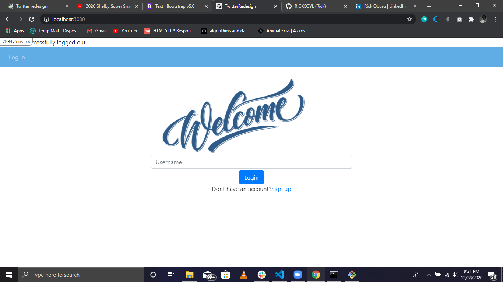
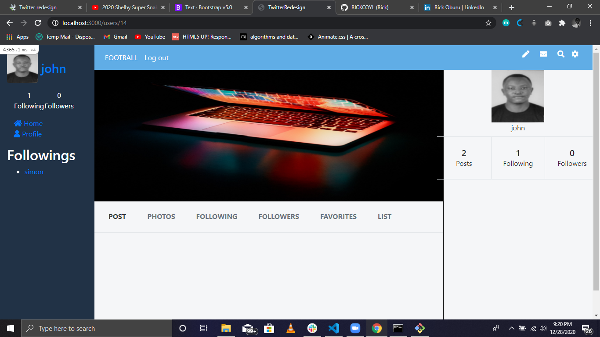

 

> In this project, we were required to build a social app where users can sign-up/sign-in/sign out, create tweets, and follow/unfollow other users.
>  
> In app users can <b>sign up/sign in . Users can upload a profile and cover images at the sign-up or after they sign in by accessing the profile page, here they can also edit their username and full name.
>  
> The app is tested using RSpec for unit and integration tests

## This web app is live, you can check it here: [Live demo]()

## Screenshots of the app.

## Built With

- Ruby
- Rails
- RSpec
- PostgreSQL
- Rails Active Storage
- Bootstrap
- Fontawesome

## App functionality

- Users can sign up/sign in/sign out
- Users can createtweets
- Users can upload a profile and cover images when they sign up, otherwise they will have default placeholders
- Users can edit their profile username and images
- Users can follow and unfollow other users
- Users can see who he is following and who are following other users

## Prerequisities

To get this project up and running locally, you must have ruby and postgres installed on your computer.

## Getting Started

**To get this project set up on your local machine, follow these simple steps:**

**Step 1** 
Navigate through the local folder where you want to clone the repository and run 
`git clone https://github.com/RICKCOYL/twitter.git`. It will clone the repo to your local folder. 

**Step 2** 
Run `cd twitter` 
**Step 3** 
Run `bundle install` to install the gems from the `Gemfile`. 
**Step 4** 
Run `yarn install` to install the npm packages from the `package.json` file. 
**Step 5** 
Run `rails db:create` and `rails db:migrate` to create and migrate the database tabels and associations. 
**Step 6** 
Run `rails s` to start the rails server. 
**Step 7** 
You can visit the app at `http://localhost:3000`.

## Tests

1. Open Terminal

2. Migrate the test database:

   `rails db:migrate RAILS_ENV=test`

3. Run the tests with the command:

   `rspec`

## Authors

👤 **Rick Oburu**

- Github: [https://github.com/RICKCOYL](https://github.com/RICKCOYL)
- Twitter: [https://twitter.com/Rickcoyl](https://twitter.com/Rickcoyl)
- Linkedin: [https://www.linkedin.com/in/rick-oburu-8627591a4/](https://www.linkedin.com/in/rick-oburu-8627591a4/)

## Show your support

If you've read this far....give us a ⭐️!

## 📝 License

This project is licensed by Microverse and the Odin Project

## Acknowledgement

- Design idea by [Gregoire Vella on Behance](https://www.behance.net/gregoirevella)
